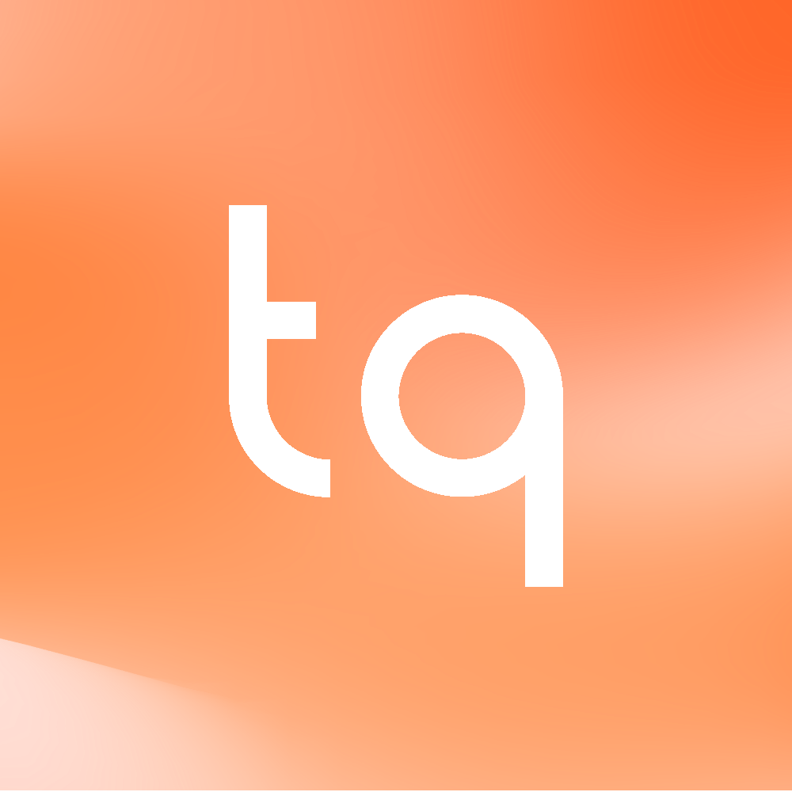

# Tepan Quiz

<p align="center">
  
</p>

Tepan Quiz is a modern Quizlet-like web application built with Laravel, Inertia.js, and React. It allows users to create, manage, and study quizzes with flashcards and learning sessions.

## Features

- User authentication (register, login, email verification)
- Create, edit, and delete quizzes
- Add, edit, import, and delete terms (flashcards) for each quiz
- Study with Flashcard mode (flip cards)
- Interactive Learn mode with session tracking and review
- Test mode (multiple-choice quiz)
- Profile and password settings pages
- Responsive, modern UI with light/dark mode
- Bulk import of terms with custom separators
- Progress tracking in learn sessions
- UI built with shadcn/ui and Radix UI components
- Improved user menu and sidebar navigation

## Tech Stack

- **Backend:** Laravel 12, Inertia.js
- **Frontend:** React 19, TypeScript, Tailwind CSS
- **Database:** SQLite (default, can be changed)

## Getting Started

### Prerequisites

- PHP >= 8.2
- Node.js >= 18
- Composer

### Installation

1. **Clone the repository:**
    ```sh
    git clone <your-repo-url>
    cd copy-quizlet
    ```
2. **Install PHP dependencies:**
    ```sh
    composer install
    ```
3. **Install JS dependencies:**
    ```sh
    npm install
    ```
4. **Copy .env and generate app key:**
    ```sh
    cp .env.example .env
    php artisan key:generate
    ```
5. **Run migrations:**
    ```sh
    php artisan migrate
    ```
6. **Start the development servers:**
    ```sh
    npm run dev
    php artisan serve
    ```
    Or use the all-in-one command:
    ```sh
    composer dev
    ```

Visit [http://localhost:8000](http://localhost:8000) to view the app.

## Usage

1. Register a new account or log in.
2. Create a new quiz from the dashboard.
3. Add terms (flashcards) manually or use the import feature for bulk entry.
4. Study your quiz using Flashcard or Learn mode.

## Project Structure

- `app/Models/` — Eloquent models for Quiz, Term, User
- `app/Http/Controllers/QuizController.php` — Main controller for quiz logic
- `resources/js/pages/` — React pages (dashboard, quiz, edit, flashcards, learn, etc.)
- `resources/views/app.blade.php` — Main Blade template
- `routes/web.php` — Main web routes
- `database/migrations/` — Database schema
- `public/logo.png` — Project logo

## Scripts

- `npm run dev` — Start Vite dev server
- `npm run build` — Build frontend assets
- `composer dev` — Start backend, queue, and frontend together (see composer.json)
- `php artisan migrate` — Run database migrations

## License

This project is open-sourced under the MIT license.

---

<p align="center">
  
</p>
